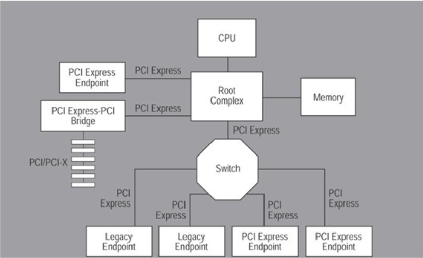
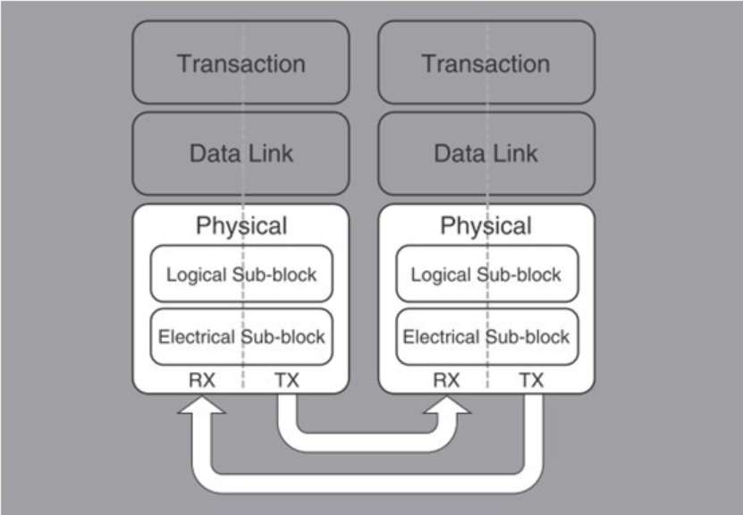
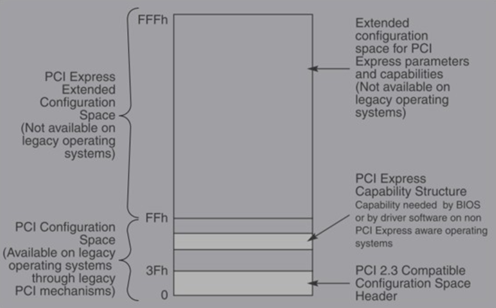
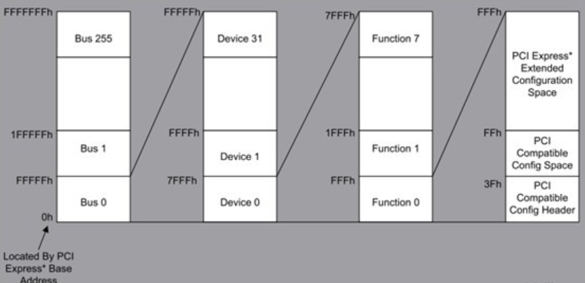
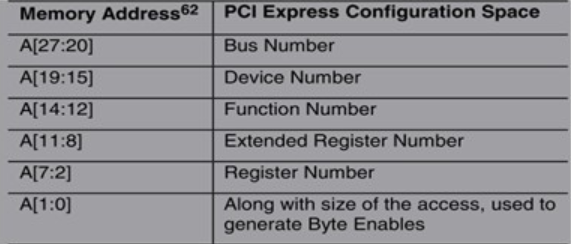

# 0. 概述
&emsp;&emsp;[PCI-Express](https://baike.baidu.com/item/pcie/2167538?fr=aladdin)(peripheral component interconnect express)是一种高速串行计算机扩展总线标准，它原来的名称为“3GIO”，是由英特尔在2001年提出的，旨在替代旧的PCI，PCI-X和AGP总线标准。PCIe交由PCI-SIG（PCI特殊兴趣组织）认证发布后才改名为“PCI-Express”，简称“PCI-e”。它的主要特点是高速串行点对点双通道高带宽传输，具有相当大的发展潜力。PCI Express也有多种规格，截止2019年1月份，当前主流主板均支持pcie 3.0。
# 1. [什么是PCI-e](https://zhuanlan.zhihu.com/p/26172972)？
&emsp;&emsp;自PC在1981年被IBM发明以来，主板上都有扩展槽用于扩充计算机功能。现在最常见的扩展槽是PCIe插槽，实际上在你看不见的计算机主板芯片内部，各种硬件控制模块大部分也是以PCIe设备的形式挂载到了一颗或者几颗PCI/PCIe设备树上。固件和操作系统正是通过枚举设备树们才能发现绝大多数即插即用（PNP）设备的。那究竟什么是PCI呢？
## 1.1. PCI/PCI-e历史
&emsp;&emsp;在我们看PCIe是什么之前，我们应该要了解一下PCIe的祖先们。
- ISA (Industry Standard Architecture)：第一代ISA插槽出现在第一代IBM PC XT机型上（1981），可以说IBM是扩展总线标准的开山鼻祖；

- MCA (Micro Channel Architecture)：IBM在PS/2产品线上引入了MCA总线，兼容ISA；

- EISA (Extended Industry Standard Architecture)：为抗衡IBM的MCA标准，几家PC兼容机厂商联合起来捣鼓出来EISA，兼容ISA；

- VLB (VESA Local Bus)：VLB的出现标志着高速总线时代来临；

- PCI (Peripheral Component Interconnect)：Intel在1992年提出PCI总线协议，标志扩展总线标准进入高速发展阶段；

- PCI-X (Peripheral Component Interconnect eXtended)：Intel召集其它的小伙伴组成了名为PCI-SIG (PCI Special Interest Group)（PCI 特殊兴趣组J）的企业联盟，从那以后这个组织就负责PCI和其继承者们（PCI-X和PCIe的标准制定和推广），PCI-X主要用于服务器与高速外设的连接；

- AGP (Accelerated Graphics Port)：专门用于北桥与显卡的连接；

- PCI Express (Peripheral Component Interconnect Express)：2004年，PCI-e诞生，目前第5代（gen5）已经开始起草，Intel的开放行为，使PCI/PCI-e标准被广泛推广和使用，并逐渐一统江湖，构建起完善的PC生态系统。

| 标准 | 时钟 | 传输位宽 | 时钟数据/s | 带宽 | 厂商 | 行代码
:--:|:--:|:--:|:--:|:--:|:--:|:--:
ISA|4.77MHz|8|1|4.77MB/s|IBM(1981)
ISA|8MHz|16|0.5|8MB/s|IBM(1984)
MCA|5MHz|16|1|10MB/s|IBM
MCA|5MHz|32|1|20MB/s|IBM
EISA|8.33MHz|32|1|33.3MB/s(16.7MB/s typically)|其他
VLB|33MHz|32|1|133MB/s|其他
PCI|33MHz|32|1|133MB/s|Intel(1992)
PCI-x66|66MHz|64|1|533MB/s|PCI-SIG
PCI-x133|133MHz|64|1|1066MB/s|PCI-SIG
PCI-x266|133MHz|64|2|2132MB/s|PCI-SIG
PCI-x533|133MHz|64|4|4266MB/s|PCI-SIG
AGPx1|66MHz|32|1|266MB/s|PCI-SIG
AGPx2|66MHz|32|2|533MB/s|PCI-SIG
AGPx4|66MHz|32|4|1066MB/s|PCI-SIG
AGPx8|66MHz|32|8|2133MB/s|PCI-SIG
PCIe 1.0 x1|2.5GHz|1|1|250MB/s|PCI-SIG(2004)|8b/10b
PCIe 1.0 x4|2.5GHz|4|1|1000MB/s|PCI-SIG|8b/10b
PCIe 1.0 x8|2.5GHz|8|1|2000MB/s|PCI-SIG|8b/10b
PCIe 1.0 x16|2.5GHz|16|1|4000MB/s|PCI-SIG|8b/10b
PCIe 2.0 x1|5GHz|1|1|500MB/s|PCI-SIG|8b/10b
PCIe 2.0 x4|5GHz|4|1|2000MB/s|PCI-SIG|8b/10b
PCIe 2.0 x8|5GHz|8|1|4000MB/s|PCI-SIG|8b/10b
PCIe 2.0 x16|5GHz|16|1|8000MB/s|PCI-SIG|8b/10b
PCIe 3.0 x1|8GHz|1|1|1000MB/s|PCI-SIG|128b/130b
PCIe 3.0 x4|8GHz|4|1|4000MB/s|PCI-SIG|128b/130b
PCIe 3.0 x8|8GHz|8|1|8000MB/s|PCI-SIG|128b/130b
PCIe 3.0 x16|8GHz|16|1|16000MB/s|PCI-SIG|128b/130b
PCIe 4.0 x1|16GHz|1|1|2000MB/s|PCI-SIG|128b/130b
PCIe 4.0 x4|16GHz|4|1|8000MB/s|PCI-SIG|128b/130b
PCIe 4.0 x8|16GHz|8|1|16000MB/s|PCI-SIG|128b/130b
PCIe 4.0 x16|16GHz|16|1|32000MB/s|PCI-SIG|128b/130b
PCIe 5.0 x1|32/25GHz|1|1|3.9/3.08GB/s|PCI-SIG|128b/130b
PCIe 5.0 x4|32/25GHz|4|1|15.8/12.3GB/s|PCI-SIG|128b/130b
PCIe 5.0 x8|32/25GHz|8|1|31.5/24.6GB/s|PCI-SIG|128b/130b
PCIe 5.0 x16|32/25GHz|16|1|63.0/49.2GB/s|PCI-SIG|128b/130b
## 1.2. PCI-e相对PCI的优势
- PCIe总线使用两对数据线实现传输，TxRx。所有总线简化了很多，响应的设计成本会降低。

- 两个设备之间点对点串行互联，不同于PCI的共享一条总线资源，PCIe采用点对点技术，每个设备独享通道带宽，可以提高数据传输率。

- 采用双通道传输，类似于全双工模式。

- 支持热插拔，hotplug，这点让用户使用起来更方便。

- 智能电源管理，支持低功耗。支持ACPI。

- 软件对PCI架构的兼容，使用PCI那套软件方式即可配饰PCIe设备。

- 测试方式简单化，通过简单连接即可测试设备。

# 2. PCI/PCI-e架构
## 2.1. PCI架构
&emsp;&emsp;这里不再介绍PCI架构，相关介绍可参阅[深入PCI与PCIe之一：硬件篇](https://zhuanlan.zhihu.com/p/26172972),上面对PCI的架构及特点有较为详细的介绍。
## 2.2. PCI-e架构
&emsp;&emsp;PCI后期越来越不能适应高速发展的数据传输需求，PCI-X和AGP走了两条略有不同的路径，PCI-x不断提高时钟频率，而AGP通过在一个时钟周期内传输多次数据来提速。随着频率的提高，PCI并行传输遇到了干扰的问题：高速传输的时候，并行的连线直接干扰异常严重，而且随着频率的提高，干扰（EMI Electromagnetic Interference）越来越不可跨越。

&emsp;&emsp;PCIe和PCI最大的改变是由[并行改为串行](https://blog.csdn.net/Dingjiawang6/article/details/81093518)(为什么？参阅[为什么串口比并口快？](https://www.zhihu.com/question/27815296?sort=created)[串行通信比并行通信的速度更高](https://blog.csdn.net/yiwuya/article/details/4136319))，通过使用[差分信号传输（differential transmission）](https://wenku.baidu.com/view/ef0b0c689b6648d7c1c746e2.html)，相同内容通过一正一反镜像传输，干扰可以很快被发现和纠正，从而可以将传输频率大幅提升。加上PCI原来基本是半双工的（地址/数据线太多，不得不复用线路），而串行可以全双工。综合下来，如果如果我们从频率提高下来得到的收益大于一次传输多个bit的收益，这个选择就是合理的。例如：
> PCI传输: 33MHz x 4B = 133MB/s

> PCIe 1.0 x1: 2.5GHz x 1b = 250MB/s (知道为什么不是2500M/8=312.5MB吗？参阅[PCIE2.0/PCIE3.0/PCIE4.0/PCIE5.0接口的带宽、速率计算](https://blog.csdn.net/weixin_42229404/article/details/84069859))

&emsp;&emsp;PCIe总线的架构可以形象化为：多组点对点相互连接的组件。下图可以看出，大概有这些组成：Root Complex（RC），多个Endpoint（PCIe设备），Switch和PCIe-PCI bridge。各个成员之间总线即为PCI Express。PCI-e的连线是由不同的lane来连接的，这些lane可以合在一起提供更高的带宽。譬如两个1lane可以合成2lane的连接，写作x2。两个x2可以变成x4，最大直到x16，往往给带宽需求最大的显卡使用。（[什么是lane？](https://blog.csdn.net/lizhiqiang5846/article/details/24801277)）

PCI-e系统框架图

# 3. [PCI-e层次结构](https://blog.csdn.net/chris_leeYC/article/details/47809285)
&emsp;&emsp;PCI-e的层次结构类似于网路偶的七层协议，如下图所示：

PCI-e层次结构

1. 物理层（PhysicalLayer）。电力方面，使用两个单向的低电压差分信号实现数据传输。也承担8b/10b的数据解码。

2. 数据链路层（DataLink Layer）。对该层传输的TLPs进行组装和分拆。为上下两层服务。

3. 传输层（Transaction Layer）。接受从软件方面送来的请求，并生成请求包传输到数据链路层。同时接受从数据链路层来的数据包，传递给软件。也就是对TLPs进行分装和组装。
4. 软件层（Software Layer）。图中未显示，软件层是保持与PCI总线兼容的关键。
# 4. [PCI-e软件配置](https://blog.csdn.net/pankul/article/details/8660014)
&emsp;&emsp;PCI-e的软件配置方式有两种：

1. PCI 兼容的配置方式。

2. PCI Express enhanced 配置机制。

# 4.1. PCI-e配置空间
&emsp;&emsp;PCIe的配置空可以分成PCI兼容部分和扩展部分。PCI兼容部分在前面256byte区域，扩展部分在后面的256byte~4Kbytes区域。如下图所示：

PCI-e配置空间

# 4.2. PCI-e高级配置机制
&emsp;&emsp;PCIe enhanced configuration mechanism的主要原理是将pcie的所有4K bytes 映射到memory地址上，这样，通过访问memory的方式即可读写PCIE的配置空间。当然，通过此方式读memory时候，最好考虑到4字节对齐的问题，否则有可能出错。

在正常的访问过程中，可以访问这一部分的memory来配置pcie，而这部分memory在哪里呢？芯片组中会定义一个base address，而base address开始的256MB的空间内则是总线上所有PCIe设备的配置空间对应的register。

PCI-e高级配置空间

PCI-e地址线对应配置

&emsp;&emsp;在程序中的表达和操作是这样的：

1. 计算出PCIe设备配置空间中寄存器的地址：Register address = PCIe_Base + (BusNO * 1MB) + (DeviceNO * 32KB) + (FuncNO* 4KB) + (Reg).

2. 使用memory 读写周期完成register的读写。