# Ecilpse IDE for C/C++ Developers Specification
## 1. 简介
Eclipse是跨平台的自由集成开发环境(IDE)。最初主要用作Java语言开发，但是亦可作为其他计算机语言如C++和Python等的开发工具。
## 2. 下载软件
- JDK(Java Development Kit)：Java语言软件开发工具包，共有SE(标准版)、EE(企业版)和ME(精简版)三种版本，此处选择[SE版本](https://www.oracle.com/technetwork/java/javase/downloads/jdk13-downloads-5672538.html)；
- IDE(Integrated Development Environment)：[Eclipse IDE 2019‑09](https://www.eclipse.org/downloads/packages/release/2019-09/r/eclipse-ide-cc-developers);
- [MinGW(Minimalist GNUfor Windows)](https://sourceforge.net/projects/mingw-w64/?source=recommended)：C/C++编译器。

## 3.安装配置
以下安装配置均在Windows环境下。

### 3.1. JDK

1. 下载JDK
点击链接进入下载页面，或者搜索[JDK官网](https://www.oracle.com/)进行下载。

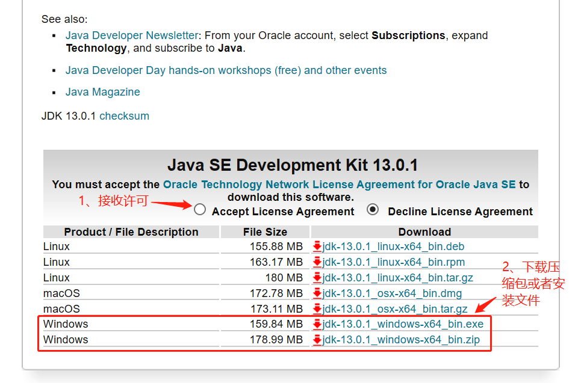

- 首先选择"Accept License Atreement";
- 下载压缩包或者安装文件，其中压缩包解压后就能直接使用，这里选择下载压缩包。

2. 环境配置

- 选择“计算机->属性->高级系统设置->系统环境”进行环境变量设置；
- 新建“JAVA_HOME”变量，配置JDK解压路径或者安装路径；

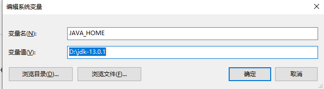

- 查找“CLASSPATH”变量，若没有则新建，配置变量，此处需要注意的是网上很多教程上的环境变量配置比较复杂，经测试是没有必要的，配置到“lib”就可以了；

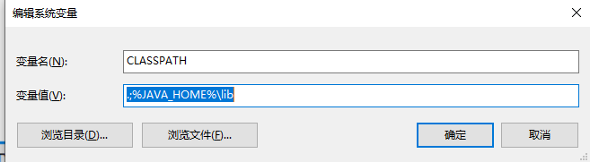

- 编辑“path”变量，此处和网上教程也有所不同，只需配置“bin”就可以了。

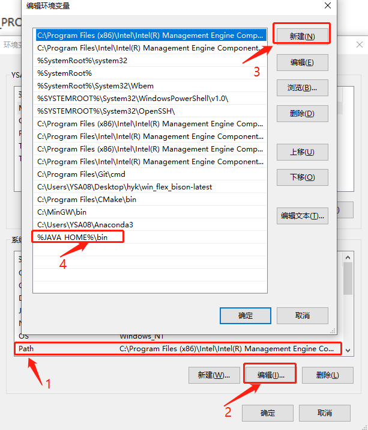

### 3.2 IDE
- 下载安装IDE：点击链接进入下载页面下载"Eclipse IDE"，根据提示安装即可，这里不再累述。

### 3.3 MinGW
 
- 下载安装MinGW：点击链接进入下载页面下载"MinGW"，建议下载64位的。因为这部分之前安装配置过，所以没有可供参考的步骤截图，可参考文章[https://blog.csdn.net/sujun10/article/details/53208050](https://blog.csdn.net/sujun10/article/details/53208050)，上面介绍的比较详细。
- 环境变量配置：参考文章中的环境变量配置较为复杂，这里只要在“系统变量->path”中添加“bin”路径即可。

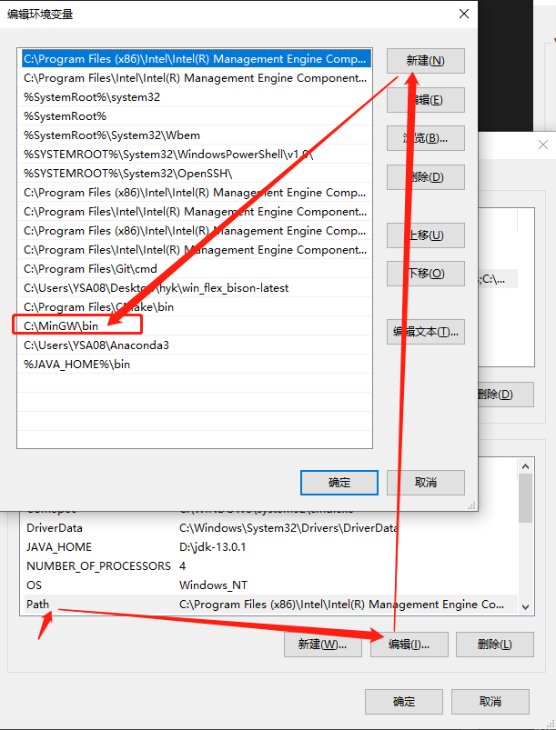

## 4.测试C/C++工程

- 打开软件Eclipse IDE for C/C++ Developers软件，选择“File->New->Project->C++ Project”,然后按下图提示完成程序创建。

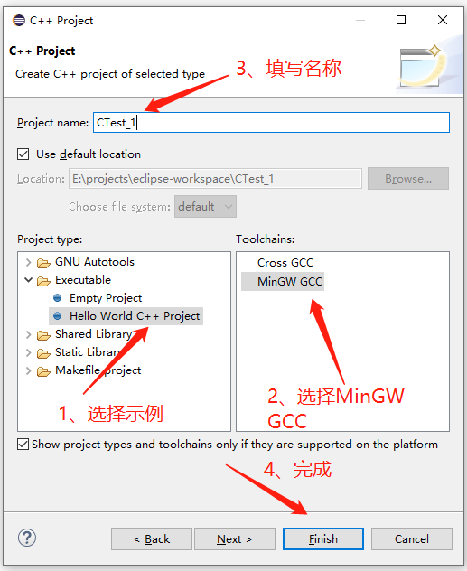

- 工程文件创建好之后长这个样子，如下图所示：

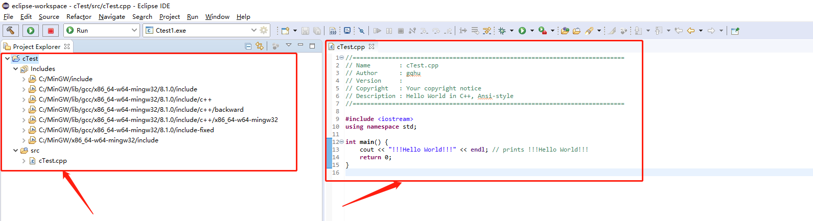

- 编译运行工程文件 ，如下图所示：

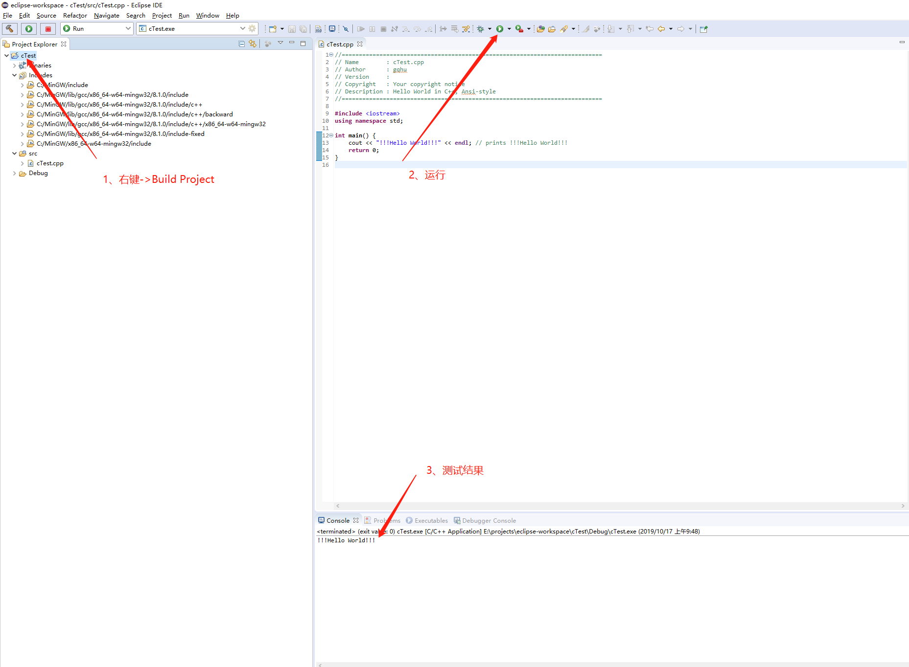

## 5.总结

- 创建工程文件时可以自动添加文件名、作者、版本号、描述等信息；

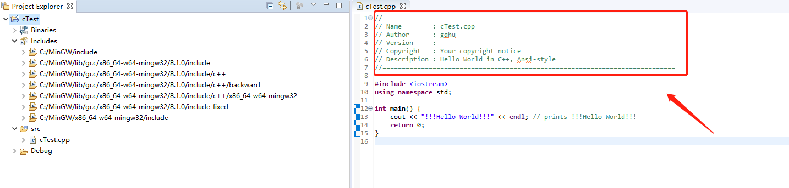

- 新建头文件时能够自动添加`ifndef`等宏定义信息；

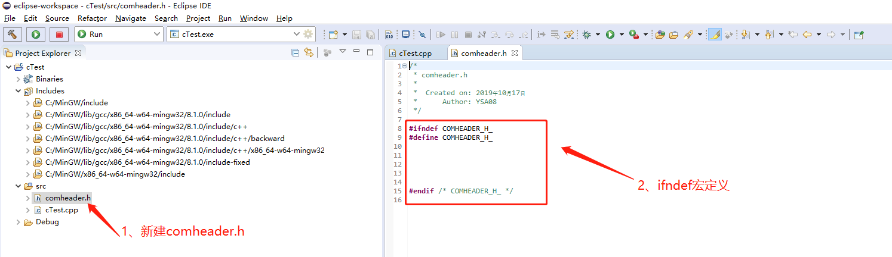

- 代码编辑智能提示功能，在输入`"."`、`"::"`、`"->"`时会给出自动提示补全功能，但是并不能对已定义的变量进行尾部提示补全，略显不足；

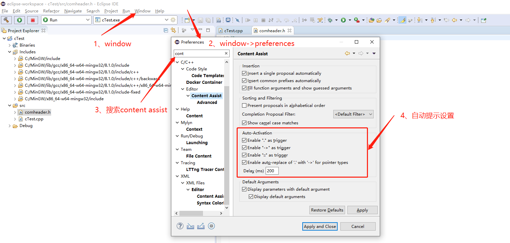

- 创建cMake Project，创建过程按下图提示，生成简单的CMakeLists.txt。

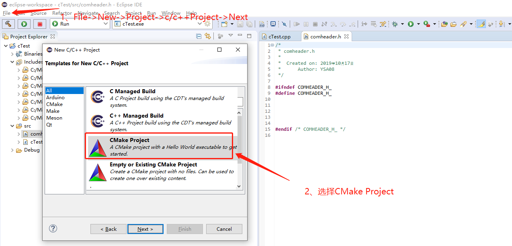

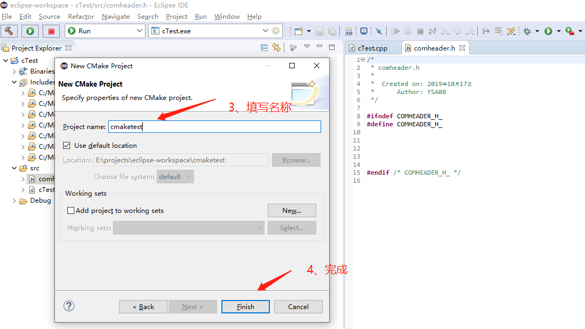

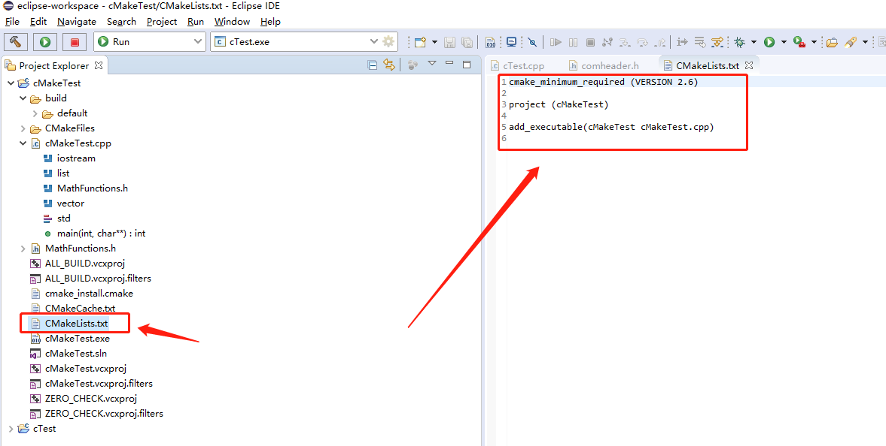