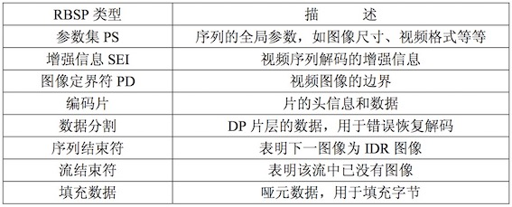

# Windows 10 System Activation
1. 打开注册表编辑器：`win+R`，输入`Regedit`.
2. 修改`SkipRearm`的值为1：`SOFTWARE–>Microsoft–>Windows NT–>CurrentVersion–>SoftwareProtectionPlatform->SkipRearm`，重启电脑。
3. `win+X`选择管理员身份启动命令符，输入：`slmgr -rearm`,根据提示重启电脑。
4. `win+X`选择管理员身份启动命令符，输入：`slmgr /ipk DCPHK-NFMTC-H88MJ-PFHPY-QJ4BJ`,回车，弹出窗口提示：成功的安装了产品密钥。
5. 输入：`slmgr /skms xykz.f3322.org`，弹出窗口提示：密钥管理服务计算机名称成功设置为xykz.f3322.org。
6. 输入：`slmgr /ato`,按回车键后将弹出窗口提示：“成功的激活了产品”。
7. 至此，Win10正式企业版系统激活成功。
# 大端&小端数据模式
计算机的字节顺序模式分为大端数据模式和小端数据模式，它们是根据数据在内存中的存储方式来区分的。小端字节顺序的数据存储模式是按内存增大的方向存储的，即低位在前高位在后；大端字节顺序的数据存储方向恰恰是相反的，即高位在前，低位在后。

# PCM16LE双音道音频封装为WAVE格式音频
## 1. WAVE格式
WAVE文件是一种RIFF格式的文件。其基本块名称是“WAVE”，其中包含了两个子块“fmt”和“data”。从编程的角度简单说来就是由WAVE_HEADER、WAVE_FMT、WAVE_DATA、采样数据共4个部分组成。它的结构如下所示。
```c
 WAVE_HEADER
 WAVE_FMT
 WAVE_DATA
 PCM数据
```
其中前3部分的结构如下所示。在写入WAVE文件头的时候给其中的每个字段赋上合适的值就可以了。但是有一点需要注意：WAVE_HEADER和WAVE_DATA中包含了一个文件长度信息的dwSize字段，该字段的值必须在写入完音频采样数据之后才能获得。因此这两个结构体最后才写入WAVE文件中。
```c
typedef struct WAVE_HEADER{
		char fccID[4];
		unsigned long dwSize;
		char fccType[4];
	}WAVE_HEADER;
 
	typedef struct WAVE_FMT{
		char  fccID[4];
		unsigned long dwSize;
		unsigned short wFormatTag;
		unsigned short wChannels;
		unsigned long dwSamplesPerSec;
		unsigned long dwAvgBytesPerSec;
		unsigned short wBlockAlign;
		unsigned short uiBitsPerSample;
	}WAVE_FMT;
 
	typedef struct WAVE_DATA{
		char       fccID[4];
		unsigned long dwSize;
	}WAVE_DATA;
```
## 2. PCM16LE格式
PCM16LE双声道数据中左声道和右声道的采样值是间隔存储的。每个采样值占用2Byte空间。采样频率一律是44100Hz，采样格式一律为16LE。“16”代表采样位数是16bit。由于1Byte=8bit，所以一个声道的一个采样值占用2Byte。“LE”代表Little Endian，代表2 Byte采样值的存储方式为高位存在高地址中。
## 3. 视频播放器解码流程
视频播放器播放一个互联网上的视频文件，需要经过以下几个步骤：解协议，解封装，解码视音频，视音频同步。如果播放本地文件则不需要解协议，为以下几个步骤：解封装，解码视音频，视音频同步。他们的过程如图所示。

# H.264视频码流解析
## 1. 原理
H.264原始码流（裸流）是由一个接一个NALU组成的，它的功能分为两层，VCL（视频编码层）和NAL（网络提取层）：
`VCL(Video Coding Layer)+NAL(Network Abstraction Layer)`

- VCL：包括核心压缩引擎和块，宏块和片的语法级别定义，设计目标是尽可能地独立于网络进行高效的编码；
- NAL：负责将VCL产生的比特字符串适配到各种各样的网络和多元环境中，覆盖了所有片级以上的语法级别。

在VCL进行数据传输或存储之前，这些编码的VCL数据，被映射或封装进NAL单元（NALU）。

```一个NALU=一组对应于视频编码的NALU头部信息+一个原始字节序列负荷（RBSP,Raw Byte Sequence Payload）```

NALU头部`+`RBSP就相当于一个NALU（NAL Unit），每个单元都按独立的NALU传送。H.264的结构全部都是以NALU为主，理解了NALU，就理解了H.264的结构。

一个原始的NALU单元一般由`StartCode+NALU Header+NALU Payload`三部分组成，其中`StartCode`用于标识这是一个NALU单元的开始，必须是`00 00 00 01`(Slice&NALU的开始)或`00 00 01`。

### (1) NAL Header
包括三部分，`forbidden_bit(1bit),nal_reference(2bits)（优先级）,nal_unit_type(5bits)(类型)`。

### (2) RBSP


#### SODB与RBSP
SODB数据比特串->编码后的原始数据。

RBSP原始字节序列载荷->在原始编码数据的后面添加了结尾比特。一个bit“1”若干比特“0”，以便字节对齐。

## 2. 从NALU出发了解H.264的专业术语

```c
1帧 = n个片
1片 = n个宏块
1宏块 = 16x16yuv数据
```
### （1）Slice（片）
NALU的主体中包含了Slice（片）。
```c
一个片 = slice header + slice data
```
片是H.264提出的新概念，一个图片有一个或者多个片，而片由nalu装载并进行网络传输。但是nalu不一定是切片，这是充分不必要条件，因为nalu还有可能装载着其他用作描述视频的信息。
#### 为什么要设置片？
设置片的目的是为了限制误码的扩散和传输，应使编码片相互间是独立的。某片的预测不能以其他片中的宏块为参考图像，这样某一片中的预测误差才不会传播到其他片中。

可以看到上图中，每个图像中，若干宏块(Macroblock)被排列成片。一个视频图像可编程一个或更多个片，每片包含整数个宏块 (MB),每片至少包含一个宏块。

#### 片有五种类型：

### (2) Macroblock(宏块)
宏块是视频信息的主要承载者，一个编码图像通常划分为多个宏块。视频解码最主要的工作室提供高效的方式从码流中获取宏块中的像素阵列。

H.264中，句法元素共被组织成序列、图像、片、宏块、子宏块五个层次。

句法元素的分层结构有助于更有效地节省码流。例如，再一个图像中，经常会在各个片之间有相同的数据，如果每个片都同时携带这些数据，势必会造成码流的浪费。更为有效的做法是将该图像的公共信息抽取出来，形成图像一级的句法元素，而在片级只携带该片自身独有的句法元素。


### (3) I、P、B帧与pts/dts

### (4) GOP
GOP是画面组，一个GOP是一组连续的画面。GOP一般有两个数字，如M=3，N=12.M制定I帧与P帧之间的距离，N指定两个I帧之间的距离。由此可知GOP的结构为：
```
I BBP BBP BBP BB I
```
### (5) IDR
一个序列的第一个图像是IDR（立即刷新图像），IDR图像都是I帧图像。

I和IDR帧都使用帧内预测。I帧不用参考任何帧，但是之后的P帧和B帧是有可能参考这个I帧之前的帧的。
#### 作用
H.264 引入 IDR 图像是为了解码的重同步，当解码器解码到 IDR 图像时，立即将参考帧队列清空，将已解码的数据全部输出或抛弃，重新查找参数集，开始一个新的序列。这样，如果前一个序列出现重大错误，在这里可以获得重新同步的机会。IDR图像之后的图像永远不会使用IDR之前的图像的数据来解码。
# FFmpeg+SDL视频播放器的制作


# 模板
## 1. 函数模板
### @定义
```c
template <class/typename type> ret-type func-name(parameter list)
{
   // 函数的主体
}
```
其中，type是数据类型的占位符名称。
### @举例
```c
#include <iostream>
#include <string>
 
using namespace std;
/**
* @函数模板
* @inline内联函数，内联函数和普通函数的区别在于：当编译器处理调用内联函数的语句时，不会将该语句编译成函数调用的指令，而是直接将整个函数体的代码插人调用语句处，就像整个函数体在调用处被重写了一遍一样。有了内联函数，就能像调用一个函数那样方便地重复使用一段代码，而不需要付出执行函数调用的额外开销。
* @const&常量引用，这样做的好处是，引用可以减少数值传递过程中的时间，而const则保证这个传过来的值在使用时不会被改变。
**/
template <typename T>
inline T const& Max (T const& a, T const& b) 
{ 
    return a < b ? b:a; 
} 
int main ()
{
 
    int i = 39;
    int j = 20;
    cout << "Max(i, j): " << Max(i, j) << endl; 
 
    double f1 = 13.5; 
    double f2 = 20.7; 
    cout << "Max(f1, f2): " << Max(f1, f2) << endl; 
 
    string s1 = "Hello"; 
    string s2 = "World"; 
    cout << "Max(s1, s2): " << Max(s1, s2) << endl; 
 
   return 0;
}
```
## 2. 类模板
### @定义
```c
template <class type> class class-name {
.
}
```
### @举例
```c
#include <iostream>
#include <vector>
#include <cstdlib>
#include <string>
#include <stdexcept>
 
using namespace std;
 
template <class T>
class Stack { 
  private: 
    vector<T> elems;     // 元素 
 
  public: 
    void push(T const&);  // 入栈
    void pop();               // 出栈
    T top() const;            // 返回栈顶元素
    bool empty() const{       // 如果为空则返回真。
        return elems.empty(); 
    } 
}; 
 
template <class T>
void Stack<T>::push (T const& elem) 
{ 
    // 追加传入元素的副本
    elems.push_back(elem);    
} 
 
template <class T>
void Stack<T>::pop () 
{ 
    if (elems.empty()) { 
        throw out_of_range("Stack<>::pop(): empty stack"); 
    }
    // 删除最后一个元素
    elems.pop_back();         
} 
 
template <class T>
T Stack<T>::top () const 
{ 
    if (elems.empty()) { 
        throw out_of_range("Stack<>::top(): empty stack"); 
    }
    // 返回最后一个元素的副本 
    return elems.back();      
} 
 
int main() 
{ 
    try { 
        Stack<int>         intStack;  // int 类型的栈 
        Stack<string> stringStack;    // string 类型的栈 
 
        // 操作 int 类型的栈 
        intStack.push(7); 
        cout << intStack.top() <<endl; 
 
        // 操作 string 类型的栈 
        stringStack.push("hello"); 
        cout << stringStack.top() << std::endl; 
        stringStack.pop(); 
        stringStack.pop(); 
    } 
    catch (exception const& ex) { 
        cerr << "Exception: " << ex.what() <<endl; 
        return -1;
    } 
}
```
# vector
Definition|Specification
:--:|:--:
push_back |在数组的最后添加一个数据 
pop_back |去掉数组的最后一个数据 
at |得到编号位置的数据 
begin |得到数组头的指针 
end |得到数组的最后一个单元+1的指针 
front |得到数组头的引用 
back |得到数组的最后一个单元的引用 
max_size |得到vector最大可以是多大 
capacity |当前vector分配的大小 
size |当前使用数据的大小 
resize |改变当前使用数据的大小，如果它比当前使用的大，者填充默认值 
reserve |改变当前vecotr所分配空间的大小 
erase |删除指针指向的数据项 
clear |清空当前的vector 
rbegin |将vector反转后的开始指针返回(其实就是原来的end-1) 
rend |将vector反转构的结束指针返回(其实就是原来的begin-1) 
empty |判断vector是否为空 
swap |与另一个vector交换数据
# 重载运算符和重载函数
## 1. 函数重载
在同一个作用域内，可以声明几个功能类似的同名函数，但是这些同名函数的形式参数（指参数的个数、类型或者顺序）必须不同。
## 2. 运算符重载
### @定义
重载的运算符是带有特殊名称的函数，函数名是由关键字 operator 和其后要重载的运算符符号构成的。与其他函数一样，重载运算符有一个返回类型和一个参数列表。
```c
Box operator+(const Box&);
```
声明加法运算符用于把两个 Box 对象相加，返回最终的 Box 对象。大多数的重载运算符可被定义为普通的非成员函数或者被定义为类成员函数。如果我们定义上面的函数为类的非成员函数，那么我们需要为每次操作传递两个参数，如下所示：
```c
Box operator+(const Box&, const Box&);
```
### @实例
```c
#include <iostream>
using namespace std;
 
class Box
{
   public:
 
      double getVolume(void)
      {
         return length * breadth * height;
      }
      void setLength( double len )
      {
          length = len;
      }
 
      void setBreadth( double bre )
      {
          breadth = bre;
      }
 
      void setHeight( double hei )
      {
          height = hei;
      }
      // 重载 + 运算符，用于把两个 Box 对象相加
      Box operator+(const Box& b)
      {
         Box box;
         box.length = this->length + b.length;
         box.breadth = this->breadth + b.breadth;
         box.height = this->height + b.height;
         return box;
      }
   private:
      double length;      // 长度
      double breadth;     // 宽度
      double height;      // 高度
};
// 程序的主函数
int main( )
{
   Box Box1;                // 声明 Box1，类型为 Box
   Box Box2;                // 声明 Box2，类型为 Box
   Box Box3;                // 声明 Box3，类型为 Box
   double volume = 0.0;     // 把体积存储在该变量中
 
   // Box1 详述
   Box1.setLength(6.0); 
   Box1.setBreadth(7.0); 
   Box1.setHeight(5.0);
 
   // Box2 详述
   Box2.setLength(12.0); 
   Box2.setBreadth(13.0); 
   Box2.setHeight(10.0);
 
   // Box1 的体积
   volume = Box1.getVolume();
   cout << "Volume of Box1 : " << volume <<endl;
 
   // Box2 的体积
   volume = Box2.getVolume();
   cout << "Volume of Box2 : " << volume <<endl;
 
   // 把两个对象相加，得到 Box3
   Box3 = Box1 + Box2;
 
   // Box3 的体积
   volume = Box3.getVolume();
   cout << "Volume of Box3 : " << volume <<endl;
 
   return 0;
}
```
# 类成员变量初始化
C++类成员变量初始化有两种方式：构造函数<i><b>初始化列表</b></i>和构造函数体内<i><b>赋值</b></i>。根据应用场景不同，分别介绍如下：
## 1. 内部数据类型
```c
class Animal  
{  
public:  
    Animal(int weight,int height):       //A初始化列表  
      m_weight(weight),  
      m_height(height)  
    {  
    }  
    Animal(int weight,int height)       //B函数体内初始化  
    {  
        m_weight = weight;  
        m_height = height;  
    }  
private:  
    int m_weight;  
    int m_height;  
};  
```
对于这些内部类型来说，基本上是没有区别的，效率上也不存在多大差异。当然A和B方式不能共存的。
## 2. 无默认构造函数的继承关系中
```c
class Animal  
{  
public:  
    Animal(int weight,int height):        //没有提供无参的构造函数   
      m_weight(weight),  
      m_height(height)  
    {  
}  
private:  
    int m_weight;  
    int m_height;  
};  
  
class Dog: public Animal  
{  
public:  
    Dog(int weight,int height,int type)   //error 构造函数 父类Animal无合适构造函数  
    {  
    }  
private:  
    int m_type;  
};  
```
因为子类Dog初始化之前要进行父类Animal的初始化，但是根据Dog的构造函数，没有给父类传递参数，使用了父类Animal的无参数构造函数。而父类Animal提供了有参数的构造函数，这样编译器就不会给父类Animal提供一个默认的无参数的构造函数了，所以编译时报错，说找不到合适的默认构造函数可用。要么提供一个无参数的构造函数，要么在子类的Dog的初始化列表中给父类Animal传递初始化参数，此时必须用初始化列表进行初始化，如下：
```c
class Dog: public Animal  
{  
public:  
    Dog(int weight,int height,int type):  
        Animal(weight,height)         //必须使用初始化列表增加对父类的初始化  
    {  
        ;  
    }  
private:  
    int m_type;  
};  
```
## 3. 类中const常量
类中const常量，必须在初始化列表中初始，不能使用赋值的方式初始化，如下：
```c
class Dog: public Animal  
{  
public:  
    Dog(int weight,int height,int type):  
        Animal(weight,height),   
        LEGS(4)                //必须在初始化列表中初始化  
    {  
        //LEGS = 4;           //error  
    }  
private:  
    int m_type;  
    const int LEGS;  
};  
```
## 4. 包含有自定义数据类型（类）对象的成员初始化
```c
class Food  
{  
public:  
    Food(int type = 10)  
    {  
        m_type = 10;  
    }  
    Food(Food &other)                 //拷贝构造函数  
    {  
        m_type = other.m_type;  
    }  
    Food & operator =(Food &other)      //重载赋值=函数  
    {  
        m_type = other.m_type;  
        return *this;  
    }  
private:  
    int m_type;  
};  
  
//（1）构造函数赋值方式 初始化成员对象m_food  
class Dog: public Animal  
{  
public:  
    Dog(Food &food)  
      //:m_food(food)    
    {  
        m_food = food;               //初始化 成员对象  
    }  
private:  
    Food m_food;  
};  
//使用  
Food fd;  
Dog dog(fd);   //Dog dog(fd);结果:先执行了对象类型构造函数Food(int type = 10)——>然后再执行对象类型构造函数Food & operator =(Food &other)想象是为什么？  
  
//（2）构造函数初始化列表方式  
class Dog: public Animal  
{  
public:  
    Dog(Food &food)  
      :m_food(food)                  //初始化 成员对象  
    {  
        //m_food = food;                 
    }  
private:  
    Food m_food;  
};  
//使用  
Food fd;  
Dog dog(fd);   //Dog dog(fd);结果：执行Food(Food &other)拷贝构造函数完成初始化  
```
不同的初始化方式得到不同的结果：明显构造函数初始化列表的方式得到更高的效率。
# 深拷贝和浅拷贝
## 1. 浅拷贝
举个栗子
```c
#include <iostream>  
using namespace std;
 
class Student
{
private:
	int num;
	char *name;
public:
	Student();
	~Student();
};
 
Student::Student()
{
	name = new char(20);
	cout << "Student" << endl;
 
}
Student::~Student()
{
	cout << "~Student " << (int)name << endl;
	delete name;
	name = NULL;
}
 
int main()
{
	{// 花括号让s1和s2变成局部对象，方便测试
		Student s1;
		Student s2(s1);// 复制对象
	}
	system("pause");
	return 0;
}
```
执行结果：
```
Student
~Student (name int value)
~Student (name int value)
```
调用一次构造函数，调用两次析构函数，两个对象的指针成员所指内存相同，这会导致什么问题呢？name指针被分配一次内存，但是程序结束时该内存却被释放了两次，会导致崩溃！这是由于编译系统在我们没有自己定义拷贝构造函数时，会在拷贝对象时调用默认拷贝构造函数，进行的是浅拷贝！即对指针name拷贝后会出现两个指针指向同一个内存空间。
## 2. 深拷贝
```c
#include <iostream>  
using namespace std;
 
class Student
{
private:
	int num;
	char *name;
public:
	Student();
	~Student();
	Student(const Student &s);//拷贝构造函数，const防止对象被改变
};
 
Student::Student()
{
	name = new char(20);
	cout << "Student" << endl;
 
}
Student::~Student()
{
	cout << "~Student " << (int)name << endl;
	delete name;
	name = NULL;
}
Student::Student(const Student &s)
{
	name = new char(20);
	memcpy(name, s.name, strlen(s.name));
	cout << "copy Student" << endl;
}
 
int main()
{
	{// 花括号让s1和s2变成局部对象，方便测试
		Student s1;
		Student s2(s1);// 复制对象
	}
	system("pause");
	return 0;
}
```
执行结果：调用一次构造函数，一次自定义拷贝构造函数，两次析构函数。两个对象的指针成员所指内存不同。
```
Student
copy Student
~Student (name int value)
~Student (name int value)
```
总结：浅拷贝只是对指针的拷贝，拷贝后两个指针指向同一个内存空间，深拷贝不但对指针进行拷贝，而且对指针指向的内容进行拷贝，经深拷贝后的指针是指向两个不同地址的指针。
## 3. 参考文献
- [C++面试题之浅拷贝和深拷贝的区别](https://blog.csdn.net/caoshangpa/article/details/79226270)
- [C++笔试题之smart pointer的实现](https://blog.csdn.net/caoshangpa/article/details/79221544)
- [C++智能指针实现](http://www.freesion.com/article/754715195/)
# C++ socket网络编程
## 1. 参考文献
- [C++ socket网络编程——即时通信系统](https://blog.csdn.net/lewis1993_cpapa/article/details/80589717)