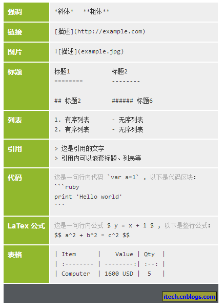
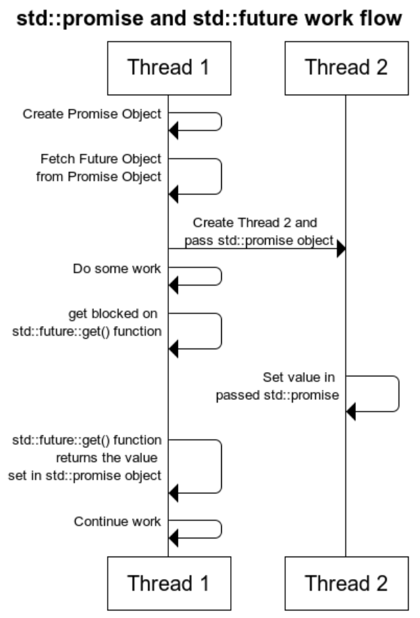

# 2019年8月8日
最近两天，学习了Slack、Git、Markdown等相关工作工具的使用方法，简单了解了OpenVX的相关资料。总结如下：
## 1. Slack
### - 简介
Slack 是一个交流沟通的软件，整合了电子邮件、短信、Google Drives、Twitter、Trello、Asana、GitHub等65种工具和服务，可以把各种碎片化的企业沟通和协作集中到一起。
### - 使用方法
登录[Slack官网](https://slack.com/intl/en-cn/)注册账号，并下载安装Slack软件。启动软件后，输入工作空间名称*YUSUR-TRD*便可进入聊天空间。
## 2. Git
### - 简介
Git是目前世界上最先进的分布式版本控制系统。
### - 使用方法
结合使用的平台，从[Git官网](https://git-scm.com/downloads)下载Git安装程序，然后按默认选项安装即可。安装完成后在开始菜单里找到“Git”->“Git Bash”，说明Git安装成功！

安装完成后，还要做进一步设置，在命令行输入：
>git config --global user.name "Your Name"

>git config --global user.email "email@example.com"

详细的安装及使用参见[廖雪峰Git教程](https://www.liaoxuefeng.com/wiki/896043488029600)
### - 问题及解决方法
#### - 远程仓库连接问题
本地Git仓库与远程Gitlab仓库建立连接过程中，遇到无法连接和推送错误等问题。
#### - 解决方法
放弃本地Git仓库与远程Gitlab仓库的连接（这部分没搞清楚，回家在自己本上再试一下），改用克隆的方式将远程Gitlab仓库克隆到本地机子上。

推送中遇到的错误是由于仓库中含有仓库文件造成的（正常情况下仓库中不能再含有仓库），将仓库中的仓库文件删除，重新推送即可。
#### *-备注*
通过[配置别名](https://www.liaoxuefeng.com/wiki/896043488029600/898732837407424)，可以提高Git的工作效率。
## 3. Markdown
Atom是github开发的开源跨平台的编辑器，拥有强大的编辑功能。
### - 使用方法
● 打开任意.md文件（markdown的文件类型）

● windows下：ctrl + shift + p 打开搜索

● 输入 markdown preview toggle(可以只输入mdpt，支持模糊匹配)
### - 基本语法

## 4. OpenVX相关资料
- [Khronos OpenVX Registry](https://www.khronos.org/registry/OpenVX/)
- [Khronos OpenVX Tutorial Material](https://github.com/rgiduthuri/openvx_tutorial/wiki)

# 2019年8月13日
近两日学习总结如下：
## 1. mysql
mysql数据库的学习，包括软件安装、语法、与第三方软件关联等。参考文献：https://www.liaoxuefeng.com/wiki/1177760294764384 等。
## 2. vs code
vscode编辑器的使用，包括环境配置、与git关联等。参考文献：laymen->YUSUR-RD-R-20180827-V2.0-开发环境使用教程.pdf，https://blog.csdn.net/sesiria/article/details/78945076 等。
## 3. c++
### - 命名空间
命名空间可作为附加信息来区分不同库中相同名称的函数、类、变量等。使用了命名空间即定义了上下文。本质上，命名空间就是定义了一个范围。
- 定义命名空间：`namespace namespace_name{/*代码*/}`
- 调用形式：
```c
#include<iostream>
using namespce std;
namespace first_space{
    void fun(){
        cout << "The first space!" << endl;
    }
}
int main(int argc, char* argx[])
{
    first_space::fun();
    return 0;
}
```
- using指令：使用`using namespace`指令，就可以不用在前面加上命名空间的名称。
```c
#include<iostream>
using namespce std;
namespace first_space{
    void fun(){
        cout << "The first space!" << endl;
    }
}
using namespace first_space;
int main(int argc, char* argx[])
{
    fun();
    return 0;
}
```
### -函数指针&指针函数
- 函数指针：一种特殊的指针，指向函数的入口，如：
```c
/**
*定义一个函数指针p，指向返回值为int，参数为两个int的函数
**/
int (*p)(int,int);
```
- 指针函数：返回值为指针的函数，如：
```c
/**
*定义一个函数p，参数为两个int，返回值为指针类型int*
**/
int* p(int, int)
```
### -重载(overload)、重写(覆盖override)、重定义(隐藏redefining)
- 重载(overload)：同一可访问区内具有不同参数列表的同名函数，根据参数列表来确定调用哪个函数。
- 重写(覆盖override)：派生类对基类的虚函数进行重新定义，函数名、返回类型、参数列表必须和基类虚函数相同，只有函数体不同。
- 重定义(隐藏redefining)：派生类函数屏蔽基类的同名函数，只要函数名相同，不管参数列表是否相同，基类函数都会被隐藏。
### -lambda函数
参考文献：https://www.cnblogs.com/langzou/p/5962033.html

简单总结如下：
>[ ]        // 不捕获任何外部变量

>[=]      // 以值的形式捕获所有外部变量

>[&]      // 以引用形式捕获所有外部变量

>[x, &y] // x 以传值形式捕获，y 以引用形式捕获

>[=, &z]// z 以引用形式捕获，其余变量以传值形式捕获

>[&, x]  // x 以值的形式捕获，其余变量以引用形式捕获

```c
cout << [](float f) { return abs(f); } (-3.5);
float f0 = 1.0;
cout << [=](float f) { return f0 + abs(f); } (-3.5);
float f0 = 1.0;
cout << [&](float f) { return f0 += abs(f); } (-3.5);
```
### -智能指针
#### 由来
为c++的内存管理填坑。
#### 思想
RAII（Resource Acquisition is Initialization）即资源获得初始化，在对象构造时获取资源，接着控制对资源的访问使之在对象的生命周期内始终保持有效，最后在对象析构的时候释放资源。
#### 要素
1. RAII思想
2. 像指针一样的行为
#### 参考文献
[RAII思想---利用对象生命周期来控制程序资源](https://blog.csdn.net/Miss_Monster/article/details/89172743) 

[三种智能指针（auto_ptr，unique_ptr，shared_ptr）](https://blog.csdn.net/miss_monster/article/details/89174315)
## - shared_ptr && make_shared函数
- shared_ptr是一个标准的共享所有权的智能指针，允许多个指针指向同一个对象，定义在memory文件中。
- shared_ptr是通过引用计数机制实现的。
- shared_ptr重载了->和*操作。
- make_shared函数的主要功能是在动态内存中分配一个对象并初始化它，返回指向此对象的shared_ptr;由于是通过shared_ptr管理内存，这是一种安全分配和使用动态内存的方法。

方法|功能|举例
:--:|:--:|:--:
make_shared|创建shared_ptr| `auto ptr = std::make_shared<int>(10);`
use_count()|参看对象的引用计数|`auto ptr1 = std::make_shared<int>(20);` `auto ptr2 = ptr1; auto ptr3(ptr2); cout << ptr1.use_count() << endl; cout ptr2.use_count() << endl; cout ptr3.use_count() << endl;`
unique()|判断是否被独占| `cout << ptr1.unique() << endl;`
reset()|放弃所持有的对象|`ptr2.reset();`
get()|获取原始指针|`int *ptr4 = ptr1.get();`
### - 仿函数
#### 定义
仿函数（functor）又称为函数对象（function object）是一个能行使函数功能的类。仿函数的语法几乎和我们普通的函数调用一样，不过作为仿函数的类，都必须重载operator()运算符。
#### 例子
```c
1  class Func{
2     public:
3         void operator() (const string& str) const {
4             cout<<str<<endl;
5         }
6 };
int main(int argc, char* args[]){
    Func()("Hello world!");
    return 0;
}
```
#### 参考文献
[仿函数](https://blog.csdn.net/u013049912/article/details/84988027)

[STL之仿函数实现详解](https://blog.csdn.net/u010710458/article/details/79734558)
### -[size_t](https://blog.csdn.net/Richard__Ting/article/details/79433814)
定义：一种数据相关的无符号类型，它被设计得足够大以便能够内存中任意对象的大小。

大小：由生成的程序类型决定，生成的程序类型与系统的类型有一定关系。

作用：某些情况下正确的使用size_t可以提高程序的可移植性和有效性。
### - [argc/argv](https://blog.csdn.net/dcrmg/article/details/51987413)
argc：argument count的缩写，表示传入main函数的参数个数；

argv：argument vector的缩写，表示传入main函数的参数序列或指针，并且第一个参数argv[0]一定是程序的名称，并且包含了程序所在的完整路径，所以确切的说需要我们输入的main函数的参数个数应该是argc-1个。
### - 右值引用
#### 概述
先来看一下左值引用的概念：`int i = 0; int& j = i;`这里int&对左值进行了绑定，但是int&不能对右值进行绑定。相应的对右值进行绑定的引用就是右值引用，语法形式：`A&&`，如`int && j = 0;`右值的相关概念比较多，包括右值、纯右值、将亡值、universal reference、引用折叠、移动语义、move语义和完美转发等。
#### 四行代码
##### 1）第一行代码：`int i = getval()`
代码中的`getval()`会产生两种类型的值，一种是左值`i`，另一种是函数`getval()`返回的临时值。临时值在表达式结束后就销毁了，左值`i`在表达式结束后依然存在。这个临时值就是右值，也是纯右值，右值是不具名的。区分左值和右值的方法：看能否对表达式取地址，如果能，则为左值，不能则为右值。
##### 2）第二行代码：`T&& k = getval()`
这是一个右值引用，函数`getval()`产生的临时值不会在表达式结束后被销毁，而是会被续命，他的生命周期将会通过右值引用被延续，和变量K的生命周期一样长。
##### 3）第三行代码：`T(T&& a) : m_val(a.m_val){ a.m_val=nullptr; }` 
这行代码是一个类的构造函数，构造函数的参数是一个右值引用。这样做是为了解决浅拷贝指针悬挂的问题，参考文章：[c++拷贝构造函数详解](https://www.cnblogs.com/alantu2018/p/8459250.html)
##### 4）第四行代码：`template <typename T>void f(T&& val){ foo(std::forward<T>(val)); }`
C++11引入了完美转发：在函数模板中，完全依照模板的参数的类型（即保持参数的左值、右值特征），将参数传递给函数模板中调用的另外一个函数。C++11中的std::forward正是做这个事情的，他会按照参数的实际类型进行转发。看下面的例子：
```c
void processValue(int& a){ cout << "lvalue" << endl; }
void processValue(int&& a){ cout << "rvalue" << endl; }
template <typename T>
void forwardValue(T&& val)
{
    processValue(std::forward<T>(val)); //照参数本来的类型进行转发。
}
void Testdelcl()
{
    int i = 0;
    forwardValue(i); //传入左值 
    forwardValue(0);//传入右值 
}
输出：
lvaue 
rvalue
```
##### 5）工厂函数
结合完美转发和移动语义来实现一个泛型的工厂函数，这个工厂函数可以创建所有类型的对象。代码清单如下：
```c
template<typename…  Args>
T* Instance(Args&&… args)
{
    return new T(std::forward<Args >(args)…);
}
```
这个工厂函数的参数是右值引用类型，内部使用std::forward按照参数的实际类型进行转发，如果参数的实际类型是右值，那么创建的时候会自动匹配移动构造，如果是左值则会匹配拷贝构造。
### - 返回值类型后置（trailing-return-type 又叫跟踪返回类型）
trailing-return-type是由decltype和auto结合完成返回值类型推导的，语法结构如下：
```c
template <typename T, typename U>
auto add(T t,U u)->decltype(t+u){};
```
#### auto
c++11中auto关键字被重新定义，用作类型推导。如`auto i = 20；`编译器会自动根据初始化表达式的值的类型去推导变量的具体类型。
#### decltype
c++11中新增的关键字，用于在编译时推导出一个表达式的类型，而不用初始化，语法格式：`decltype(expr)`。
#### 参考文献
[C++11新特性之auto&decltype](https://blog.csdn.net/hailong0715/article/details/53928128)
### - bind
bind的设计思想是一种延迟计算，将可调用对象保存起来，然后在需要的时候再调用。
bind的语法格式：
```c
auto newCallable = bind(callable, arg_list); 
```
<<<<<<< HEAD
### - noexcept
noexcept修饰符，可以用来修饰函数，在函数后面加上noexcept，代表这个函数不会抛出异常，如果抛出异常程序就会终止。
=======
>>>>>>> b15578dde51a6fe44a57dca8c63d310dbb5185ca
# 2019年8月14日
## 1. vscode开发环境配置
### 参考文献
[Using Mingw-w64 in VS Code](https://code.visualstudio.com/docs/cpp/config-mingw)

[Visual Studio Code 如何编写运行 C、C++ 程序？](https://www.zhihu.com/question/30315894)
### 注意要点
● [MinGW-w64 - for 32 and 64 bit Windows](https://sourceforge.net/projects/mingw-w64/files/)在此页面下载 MinGW-w64，往下稍微翻一下，选最新版本中的x86_64-posix-seh。
● 若要程序支持c++17标准，需在tasks.json配置文件的“argc”中设置“-std=c++17”。
## 2. vscode为md生成目录
[VSCode为Markdown自动生成目录，解决目录不整齐问题](https://blog.csdn.net/u014171091/article/details/89629634)
## 3. [c++11多线程](https://www.jianshu.com/p/dcce068ee32b)
### (1) 基本操作
#### -简介
C++11提供了一套精练的线程库，小巧且易用。运行一个线程，可以直接创建一个std::thread的实例，线程在实例构造成功时启动。
```c
#include <iostream>
#include <thread>

void foo() {
    std::cout << "Hello C++11" << std::endl;
}

int main() {
    std::thread thread(foo);  // 启动线程foo
    thread.join();  // 等待线程执行完成

    return 0;
}
```
#### -线程参数
当需要向线程传递参数时，可以直接通过std::thread的构造函数参数进行，构造函数通过完美转发将参数传递给线程函数。
```c
#include <thread>
#include <iostream>

void hello(const char *name) {
    std::cout << "Hello " << name << std::endl;
}

int main() {
    std::thread thread(hello, "C++11");
    thread.join();

    return 0;
}
```
#### - 类成员函数作为线程入口
类成员函数做为线程入口: 把this做为第一个参数传递进去即可。
```c
class Greet{
    const char* owner = "Greet";
    public:
    void sayHello(const char* name){
        cout << "Hello "<< name << " from " << this->owner << endl;
    }
};
int main(int argc, char* argv[]){

    Greet gre;
    
    thread t1(&gre.sayHello, &gre, "world");
    t1.join();

    system("pause");
    return 0;
}
```
#### - join()
作用：等待线程执行完成。
#### - 线程暂停
有时线程在运行时，确实需要“停顿”一段时间怎么办呢？可以使用std::this_thread::sleep_for或std::this_thread::sleep_until。
```c
#include <chrono>
using namespace std;
using namespace std::chrono;

void threadpause(){
    this_thread::sleep_for(milliseconds(500));
    this_thread::sleep_until(system_clock::now()+milliseconds(500));
}

int main(int argc, char* argv[]){
    thread t2(threadpause);
    t2.join();

    system("pause");
    return 0;
}
```
#### - 线程停止
一般情况下当线程函数执行完成后，线程“自然”停止。但在std::thread中有一种情况会造成线程异常终止，那就是：析构。当std::thread实例析构时，如果线程还在运行，则线程会被强行终止掉，这可能会造成资源的泄漏，因此尽量在析构前join一下，以确保线程成功结束。如果确实想提前让线程结束怎么办呢？一个简单的方法是使用“共享变量”，线程定期地去检测该量，如果需要退出，则停止执行，退出线程函数。使用“共享变量”需要注意，在多核、多CPU的情况下需要使用“原子”操作。
#### - 拷贝
```c
std::thread a(foo);
std::thread b;
b = a;
```
当执行以上代码时，会发生什么？最终foo线程是由a管理，还是b来管理？答案是由b来管理。std::thread被设计为只能由一个实例来维护线程状态，以及对线程进行操作。因此当发生赋值操作时，会发生线程所有权转移。
#### - detach/joinable
```c
void detach();
bool joinable() const;
```
<<<<<<< HEAD
detach是std::thread的成员函数，函数原型如上所示。thread::detach():从thread对象分离执行的线程，允许执行独立地持续。一旦线程退出，则释放所有分配的资源。detach以后就失去了对线程的所有权，不能再调用join了，因为线程已经分离出去了，不再归该实例管了。判断线程是否还有对线程的所有权的一个简单方式是调用joinable函数，返回true则有，否则为无。
=======
detach是std::thread的成员函数，函数原型如上所示。detach以后就失去了对线程的所有权，不能再调用join了，因为线程已经分离出去了，不再归该实例管了。判断线程是否还有对线程的所有权的一个简单方式是调用joinable函数，返回true则有，否则为无。
>>>>>>> b15578dde51a6fe44a57dca8c63d310dbb5185ca
#### - get_id
每个线程都有一个id，但此处的get_id与系统分配给线程的ID并不一是同一个东东。如果想取得系统分配的线程ID，可以调用native_handle函数。
### (2) [mutex(1)](https://www.jianshu.com/p/96eac2d183b1)
介绍了mutex的定义，分类和标准操作等。

参考阅读：

[C++11新特性之基本范围的For循环（range-based-for）](https://blog.csdn.net/hailong0715/article/details/54172848),

[浅析C++的函数式编程](https://blog.csdn.net/richenyunqi/article/details/89530589),

[c++ 中ref 和引用的区别](https://blog.csdn.net/ii0789789789/article/details/94899531)
# 2019年8月15日
### (3) [mutex(2)](https://www.jianshu.com/p/8bd389d4ed83)
介绍了C++11提供的一些易用性的类，主要包括：

● lock_guard：利用了C++ RAII的特性，在构造函数中上锁，析构函数中解锁。lock_guard是一个模板类，其原型如下所示。
```c
template <class Mutex> class lock_guard
```
● unique_lock：unique_lock拥有对Mutex的所有权，一但初始化了unique_lock，其就接管了该mutex, 在unique_lock结束生命周期前(析构前)，其它地方就不要再直接使用该mutex了。unique_lock提供的功能较多，此处不一一列举，下面列出unique_lock的类声明，及部分注释。
```c
template <class Mutex>
class unique_lock
{
public:
    typedef Mutex mutex_type;
    // 空unique_lock对象
    unique_lock() noexcept;
    // 管理m, 并调用m.lock进行上锁，如果m已被其它线程锁定，由该构造了函数会阻塞。
    explicit unique_lock(mutex_type& m);
    // 仅管理m，构造函数中不对m上锁。可以在初始化后调用lock, try_lock, try_lock_xxx系列进行上锁。
    unique_lock(mutex_type& m, defer_lock_t) noexcept;
    // 管理m, 并调用m.try_lock，上锁不成功不会阻塞当前线程
    unique_lock(mutex_type& m, try_to_lock_t);
    // 管理m, 该函数假设m已经被当前线程锁定，不再尝试上锁。
    unique_lock(mutex_type& m, adopt_lock_t);
    // 管理m, 并调用m.try_lock_unitil函数进行加锁
    template <class Clock, class Duration>
        unique_lock(mutex_type& m, const chrono::time_point<Clock, Duration>& abs_time);
    // 管理m，并调用m.try_lock_for函数进行加锁
    template <class Rep, class Period>
        unique_lock(mutex_type& m, const chrono::duration<Rep, Period>& rel_time);
    // 析构，如果此前成功加锁(或通过adopt_lock_t进行构造)，并且对mutex拥有所有权，则解锁mutex
    ~unique_lock();

    // 禁止拷贝操作
    unique_lock(unique_lock const&) = delete;
    unique_lock& operator=(unique_lock const&) = delete;

    // 支持move语义
    unique_lock(unique_lock&& u) noexcept;
    unique_lock& operator=(unique_lock&& u) noexcept;

    void lock();
    bool try_lock();

    template <class Rep, class Period>
        bool try_lock_for(const chrono::duration<Rep, Period>& rel_time);
    template <class Clock, class Duration>
        bool try_lock_until(const chrono::time_point<Clock, Duration>& abs_time);

    // 显示式解锁，该函数调用后，除非再次调用lock系列函数进行上锁，否则析构中不再进行解锁
    void unlock();

    // 与另一个unique_lock交换所有权
    void swap(unique_lock& u) noexcept;
    // 返回当前管理的mutex对象的指针，并释放所有权
    mutex_type* release() noexcept;

    // 当前实例是否获得了锁
    bool owns_lock() const noexcept;
    // 同owns_lock
    explicit operator bool () const noexcept;
    // 返回mutex指针，便于开发人员进行更灵活的操作
    // 注意：此时mutex的所有权仍归unique_lock所有，因此不要对mutex进行加锁、解锁操作
    mutex_type* mutex() const noexcept;
};
```
● std::call_once：保证call_once调用的函数只被执行一次。该函数需要与std::once_flag配合使用。
● 其他：参见[C++11多线程-mutex(2)](https://www.jianshu.com/p/8bd389d4ed83)
### (4) [条件变量conditon variable](https://www.jianshu.com/p/c1dfa1d40f53)
头文件：`#include <condition_variable>`

接口：`notify_one()`唤醒休眠状态的线程；`wait()`让线程进入休眠状态。
### (5) [future & promise](https://blog.csdn.net/qq_35976351/article/details/84186042)
`future`和`promise`的作用是在不同线程之间传递数据。假设线程1需要线程2的数据，那么操作流程如下：
>线程1初始化一个promise对象和一个future对象，promise传递给线程2，相当于线程2对线程1的一个承诺；future相当于一个接受一个承诺，用来获取未来线程2传递的值

>线程2获取到promise后，需要对这个promise传递有关的数据，之后线程1的future就可以获取数据了。

>如果线程1想要获取数据，而线程2未给出数据，则线程1阻塞，直到线程2的数据到达.

一个简单的流程图如下：

<<<<<<< HEAD

=======

>>>>>>> 16118042375256aa4b0f96c173d862f01a3f8801
<<<<<<< HEAD
## 4. [并发指南](https://www.cnblogs.com/haippy/p/3235560.html)
其他参考文献：[C++11并发指南系列](https://www.cnblogs.com/haippy/p/3284540.html)
### (1) std::thread构造
方法 | 描述
|:--:|:--:|
default(1)|thread() noexcept
initialization (2) |template <class Fn, class... Args>  explicit thread (Fn&& fn, Args&&... args);
copy [deleted] (3)|thread (const thread&) = delete;
move (4)|thread (thread&& x) noexcept;
说明：
- （1）默认构造函数，创建一个空的thread执行对象；
- （2）初始化构造函数，创建一个 thread对象，该 thread对象可被 joinable，新产生的线程会调用 fn 函数，该函数的参数由 args 给出。
- （3）拷贝构造函数(被禁用)，意味着 thread 不可被拷贝构造。
- （4）move 构造函数，move 构造函数，调用成功之后 x 不代表任何 thread 执行对象。
### （2）future头文件包含的类和函数
- Providers类：std::promise,std::package_task
- Futures类：std::future,shared_future
- Providers函数：async()
- 其他类型：std::future_error, std::future_errc, std::future_status, std::launch.

std::promise构造函数
方法|描述
:--:|:--:
default(1)|promise();
with allocator(2)|template <class Alloc> promise (allocator_arg_t aa, const Alloc& alloc);
copy[deleted]|promise(const promise&)=delete;
move(4)|promise (promise&& x) noexcept;
说明：
- （1）默认构造函数：初始化一个空的共享状态
- （2）带自定义内存分配器的构造函数，与默认构造函数类似，但是使用自定义分配器分配共享状态
- （3）拷贝构造函数，被禁用
- （4）移动构造函数
### （3）packaged_task
std::packaged_task对象内部包含了两个最基本的元素，一、被包含的任务（stored task），任务（task）是一个可调用的对象，如函数指针、成员函数指针或者函数对象，二、共享状态（shared state），用于保存任务的返回值，可以通过std::future对象来达到异步访问共享状态的效果。
可以通过 std::packged_task::get_future 来获取与共享状态相关联的 std::future 对象。在调用该函数之后，两个对象共享相同的共享状态。

std::packaged_task构造函数:
方法|描述
:--:|:--:
default(1)|packaged_task() noexcept;
initialization(2)|template<class Fn> explicit packaged_task(Fn&& fn);
with allocator(3)|template<class Fn, class Alloc> explicit packaged_task (allocator_arg_t aa, const Alloc& alloc, Fn&& fn);
copy [deleted] (4)|packaged_task(const packaged_task&) = delete;
move(5)|packaged_task(packaged_task&& x) noexcept;
std::packaged_task::valid:检查当前packaged_task是否和一个有效的共享状态相关联，对于由构造函数生成的packaged_task对象，该函数返回false，除非中间进行move赋值操作或者swap操作。
### （4）future
std::future可以用来获取异步任务的结果，因此可以把它当成一种简单的线程间同步的手段。std::future通常由某个Provider创建，你可以把Provider想象成一个异步任务的提供者，Provider在某个线程中设置共享状态的值，与该共享状态相关联的std::future对象调用get（通常在另外一个线程中）获取该值。

一个有效（valid）的std::future对象通常由以下三种Provider创建，并和某个共享状态相关联。
- std::async函数。
- std::promise::get_future,get_future为promise类的成员函数。
- std::packaged_task::get_future,此时get_future为packaged_task的成员函数。

future构造函数
|方法|描述|
:--:|:--:
default(1)|future() noexcept;
copy [deleted] (2)|future (const future&) = delete;
move(3)|future (future&& x) noexcept;
- std::future::share():调用该函数之后，该std::future对象本身已经不和任何共享状态相关联，因此该std::future的状态不再是valid的了。
- std::future::get:返回Provider所设置的共享状态的值或者异常。
- std::future::valid()：检查当前的std::future对象是否有效。
- std::future::wait()/wait_for()/wait_until():等待与该std::future对象相关联的共享状态的标志变为ready。
- std::shared_future:与std::future类似，但是std::shared_future可以拷贝，多个std::shared_future可以共享状态的最终结果。shared_future可以通过某个std::future对象隐式转换，或者通过std::future::share()显示转换。构造函数如下：

方法|说明
:--:|:--:
default(1)|shared_future() noexcept;
copy(2)|shared_future(const shared_future& x);
move(3)|shared_future(shared_future&& x) noexcept;
move from future(4)|shared_future(future<T>&& x) noexcept;
最后move from future（4）即从一个有效的std::future对象构造成一个std::shared_future，构造之后std::future对象x变为无效（not-valid）。
### (5)atomic_flag
< atomic >头文件：原子类型是封装了一个值的类型，它的访问保证不会导致数据的竞争，并且可以用于在不同的线程之间同步内存访问。这个头声明了两个c++类，原子和atomic_flag，它实现了自包含类中的原子类型的所有特性。结构如下：
class|Introductions  
:--:|:--:
atomic| 用于bool、整数和指针类型的原子类模板和特殊化 (类模板)
atomic_flag|无锁布尔原子类型(类)
atomic_flag是一种简单的原子布尔型，只支持两种操作，test-and-set和clear。
std::atomic_flag构造函数如下：
- atomic_flag() noexcept = default;
- atomic_flag(const atomic_flag& T) = delete;
std::atomic_flag只有默认构造函数，拷贝构造函数已被禁用，因此不能从其他的 std::atomic_flag 对象构造一个新的 std::atomic_flag 对象。

=======
>>>>>>> b15578dde51a6fe44a57dca8c63d310dbb5185ca
## 1. tensorflow
### (1)安装
windows环境下安装：>pip install tensorflow 

安装过程中遇到的问题：tensorboard 1.14.0 has requirement setuptools>=41.0.0 , but you'll have setuptools 40.8.0 which is incompatible

原因：setuptools 版本太低

办法：更新setuptools版本 输入 pip install --upgrade setuptools
<<<<<<< HEAD
### (2)基本使用
- 使用图(graph)来表示计算任务
- 在被称之为回话(Session)的上下文(context)中执行图
- 使用tensor表示数据
- 通过变量(variable)维护状态
- 使用feed和fetch可以为任意的操作(arbitrary operation)赋值或者从中获取数据
### (3)参考文献
- [TensorFlow基本用法](https://www.cnblogs.com/zyly/p/8682794.html)
=======
>>>>>>> b15578dde51a6fe44a57dca8c63d310dbb5185ca
