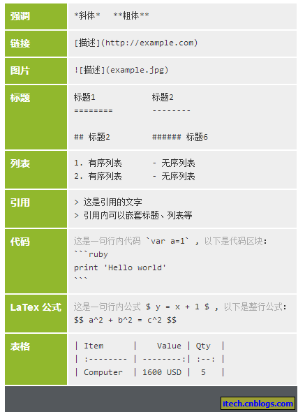

# 2019年8月8日
最近两天，学习了Slack、Git、Markdown等相关工作工具的使用方法，简单了解了OpenVX的相关资料。总结如下：
## 1. Slack
### - 简介
Slack 是一个交流沟通的软件，整合了电子邮件、短信、Google Drives、Twitter、Trello、Asana、GitHub等65种工具和服务，可以把各种碎片化的企业沟通和协作集中到一起。
### - 使用方法
登录[Slack官网](https://slack.com/intl/en-cn/)注册账号，并下载安装Slack软件。启动软件后，输入工作空间名称*YUSUR-TRD*便可进入聊天空间。
## 2. Git
### - 简介
Git是目前世界上最先进的分布式版本控制系统。
### - 使用方法
结合使用的平台，从[Git官网](https://git-scm.com/downloads)下载Git安装程序，然后按默认选项安装即可。安装完成后在开始菜单里找到“Git”->“Git Bash”，说明Git安装成功！

安装完成后，还要做进一步设置，在命令行输入：
>git config --global user.name "Your Name"

>git config --global user.email "email@example.com"

详细的安装及使用参见[廖雪峰Git教程](https://www.liaoxuefeng.com/wiki/896043488029600)
### - 问题及解决方法
#### - 远程仓库连接问题
本地Git仓库与远程Gitlab仓库建立连接过程中，遇到无法连接和推送错误等问题。
#### - 解决方法
放弃本地Git仓库与远程Gitlab仓库的连接（这部分没搞清楚，回家在自己本上再试一下），改用克隆的方式将远程Gitlab仓库克隆到本地机子上。

推送中遇到的错误是由于仓库中含有仓库文件造成的（正常情况下仓库中不能再含有仓库），将仓库中的仓库文件删除，重新推送即可。
#### *-备注*
通过[配置别名](https://www.liaoxuefeng.com/wiki/896043488029600/898732837407424)，可以提高Git的工作效率。
## 3. Markdown
Atom是github开发的开源跨平台的编辑器，拥有强大的编辑功能。
### - 使用方法
● 打开任意.md文件（markdown的文件类型）

● windows下：ctrl + shift + p 打开搜索

● 输入 markdown preview toggle(可以只输入mdpt，支持模糊匹配)
### - 基本语法

## 4. OpenVX相关资料
[Khronos OpenVX Registry](https://www.khronos.org/registry/OpenVX/)

# 2019年8月13日
近两日学习总结如下：
## 1. mysql
mysql数据库的学习，包括软件安装、语法、与第三方软件关联等。参考文献：https://www.liaoxuefeng.com/wiki/1177760294764384 等。
## 2. vs code
vscode编辑器的使用，包括环境配置、与git关联等。参考文献：laymen->YUSUR-RD-R-20180827-V2.0-开发环境使用教程.pdf，https://blog.csdn.net/sesiria/article/details/78945076 等。
## 3. c++
### -lambda函数
参考文献：https://www.cnblogs.com/langzou/p/5962033.html

简单总结如下：
>[ ]        // 不捕获任何外部变量

>[=]      // 以值的形式捕获所有外部变量

>[&]      // 以引用形式捕获所有外部变量

>[x, &y] // x 以传值形式捕获，y 以引用形式捕获

>[=, &z]// z 以引用形式捕获，其余变量以传值形式捕获

>[&, x]  // x 以值的形式捕获，其余变量以引用形式捕获

```c
cout << [](float f) { return abs(f); } (-3.5);
float f0 = 1.0;
cout << [=](float f) { return f0 + abs(f); } (-3.5);
float f0 = 1.0;
cout << [&](float f) { return f0 += abs(f); } (-3.5);
```
### -智能指针
#### 由来
为c++的内存管理填坑。
#### 思想
RAII（Resource Acquisition is Initialization）即资源获得初始化，在对象构造时获取资源，接着控制对资源的访问使之在对象的生命周期内始终保持有效，最后在对象析构的时候释放资源。
#### 要素
1. RAII思想
2. 像指针一样的行为
#### 参考文献
[RAII思想---利用对象生命周期来控制程序资源](https://blog.csdn.net/Miss_Monster/article/details/89172743) 

[三种智能指针（auto_ptr，unique_ptr，shared_ptr）](https://blog.csdn.net/miss_monster/article/details/89174315)
### - 仿函数
#### 定义
仿函数（functor）又称为函数对象（function object）是一个能行使函数功能的类。仿函数的语法几乎和我们普通的函数调用一样，不过作为仿函数的类，都必须重载operator()运算符。
#### 例子
```cpp
1  class Func{
2     public:
3         void operator() (const string& str) const {
4             cout<<str<<endl;
5         }
6 };
int main(int argc, char* args[]){
    Func()("Hello world!");
    return 0;
}
```
#### 参考文献
[仿函数](https://blog.csdn.net/u013049912/article/details/84988027)

[STL之仿函数实现详解](https://blog.csdn.net/u010710458/article/details/79734558)
# 2019年8月14日
## 1. vscode开发环境配置
### 参考文献
[Using Mingw-w64 in VS Code](https://code.visualstudio.com/docs/cpp/config-mingw)

[Visual Studio Code 如何编写运行 C、C++ 程序？](https://www.zhihu.com/question/30315894)
### 注意要点
● [MinGW-w64 - for 32 and 64 bit Windows](https://sourceforge.net/projects/mingw-w64/files/)在此页面下载 MinGW-w64，往下稍微翻一下，选最新版本中的x86_64-posix-seh。
● 若要程序支持c++17标准，需在tasks.json配置文件的“argc”中设置“-std=c++17”。
## 2. vscode为md生成目录
[VSCode为Markdown自动生成目录，解决目录不整齐问题](https://blog.csdn.net/u014171091/article/details/89629634)
## 3. [c++11多线程](https://www.jianshu.com/p/dcce068ee32b)
### (1) 基本操作
#### -简介
C++11提供了一套精练的线程库，小巧且易用。运行一个线程，可以直接创建一个std::thread的实例，线程在实例构造成功时启动。
```c
#include <iostream>
#include <thread>

void foo() {
    std::cout << "Hello C++11" << std::endl;
}

int main() {
    std::thread thread(foo);  // 启动线程foo
    thread.join();  // 等待线程执行完成

    return 0;
}
```
#### -线程参数
当需要向线程传递参数时，可以直接通过std::thread的构造函数参数进行，构造函数通过完美转发将参数传递给线程函数。
```c
#include <thread>
#include <iostream>

void hello(const char *name) {
    std::cout << "Hello " << name << std::endl;
}

int main() {
    std::thread thread(hello, "C++11");
    thread.join();

    return 0;
}
```
#### - 类成员函数作为线程入口
类成员函数做为线程入口: 把this做为第一个参数传递进去即可。
```c
class Greet{
    const char* owner = "Greet";
    public:
    void sayHello(const char* name){
        cout << "Hello "<< name << " from " << this->owner << endl;
    }
};
int main(int argc, char* argv[]){

    Greet gre;
    
    thread t1(&gre.sayHello, &gre, "world");
    t1.join();

    system("pause");
    return 0;
}
```
#### - join()
作用：等待线程执行完成。
#### - 线程暂停
有时线程在运行时，确实需要“停顿”一段时间怎么办呢？可以使用std::this_thread::sleep_for或std::this_thread::sleep_until。
```c
#include <chrono>
using namespace std;
using namespace std::chrono;

void threadpause(){
    this_thread::sleep_for(milliseconds(500));
    this_thread::sleep_until(system_clock::now()+milliseconds(500));
}

int main(int argc, char* argv[]){
    thread t2(threadpause);
    t2.join();

    system("pause");
    return 0;
}
```
#### - 线程停止
一般情况下当线程函数执行完成后，线程“自然”停止。但在std::thread中有一种情况会造成线程异常终止，那就是：析构。当std::thread实例析构时，如果线程还在运行，则线程会被强行终止掉，这可能会造成资源的泄漏，因此尽量在析构前join一下，以确保线程成功结束。如果确实想提前让线程结束怎么办呢？一个简单的方法是使用“共享变量”，线程定期地去检测该量，如果需要退出，则停止执行，退出线程函数。使用“共享变量”需要注意，在多核、多CPU的情况下需要使用“原子”操作。
#### - 拷贝
```c
std::thread a(foo);
std::thread b;
b = a;
```
当执行以上代码时，会发生什么？最终foo线程是由a管理，还是b来管理？答案是由b来管理。std::thread被设计为只能由一个实例来维护线程状态，以及对线程进行操作。因此当发生赋值操作时，会发生线程所有权转移。
#### - detach/joinable
```c
void detach();
bool joinable() const;
```
detach是std::thread的成员函数，函数原型如上所示。detach以后就失去了对线程的所有权，不能再调用join了，因为线程已经分离出去了，不再归该实例管了。判断线程是否还有对线程的所有权的一个简单方式是调用joinable函数，返回true则有，否则为无。
#### - get_id
每个线程都有一个id，但此处的get_id与系统分配给线程的ID并不一是同一个东东。如果想取得系统分配的线程ID，可以调用native_handle函数。
### (2)[mutex(1)](https://www.jianshu.com/p/96eac2d183b1)
介绍了mutex的定义，分类和标准操作等。

参考阅读：

[C++11新特性之基本范围的For循环（range-based-for）](https://blog.csdn.net/hailong0715/article/details/54172848),

[浅析C++的函数式编程](https://blog.csdn.net/richenyunqi/article/details/89530589),

[c++ 中ref 和引用的区别](https://blog.csdn.net/ii0789789789/article/details/94899531)
